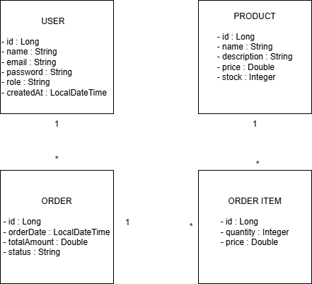

# Virtual Pet

_Tienda virtual especializada en la comercialización de productos para mascotas._

## Introducción / Contexto

_En la actualidad, el crecimiento en la tenencia de mascotas ha generado una mayor demanda de productos esenciales como alimentos, accesorios y medicamentos. No obstante, muchos establecimientos tradicionales no cuentan con plataformas digitales eficientes que permitan gestionar inventarios, visualizar productos y realizar compras en línea de manera estructurada y segura. Esta situación evidencia la necesidad de desarrollar una solución tecnológica que centralice la comercialización de productos para mascotas en un entorno digital accesible y confiable._

_La implementación de una tienda virtual como Virtual Pet resulta relevante desde el punto de vista social y empresarial, ya que facilita el acceso a productos esenciales para el bienestar animal, optimiza los procesos de venta y amplía el alcance comercial de los negocios del sector. Desde el ámbito académico, el proyecto permite aplicar conocimientos de arquitectura de software, desarrollo backend y gestión de dependencias, integrando tecnologías modernas del ecosistema Java._

_Virtual Pet se desarrolla dentro del dominio del comercio electrónico (e-commerce) y los sistemas de información, utilizando Maven como herramienta de gestión y construcción del proyecto, y Spring Boot como framework principal para la creación de una aplicación backend robusta, escalable y estructurada bajo buenas prácticas de desarrollo. De esta manera, el proyecto simula un entorno real de tienda online especializada en productos para mascotas._

## Objetivos

**Objetivo general**

_Desarrollar una tienda virtual para mascotas utilizando Spring Boot y Maven que permita gestionar y comercializar productos de manera eficiente, segura y estructurada._

**Objetivos específicos**

_1.Diseñar e implementar la arquitectura backend del sistema utilizando Spring Boot bajo el patrón de capas (controlador, servicio y repositorio)._

_2.Configurar y gestionar las dependencias del proyecto mediante Maven para garantizar una estructura organizada y mantenible._

_3.Implementar funcionalidades CRUD para la administración de productos (alimentos, accesorios y medicamentos)._

_4.Integrar una base de datos para el almacenamiento y consulta persistente de la información de productos._

_5.Validar y documentar los endpoints de la aplicación para asegurar su correcto funcionamiento y facilitar futuras integraciones._

## Alcance del proyecton (Scope)

**¿Qué se va a desarrollar?**

_*Desarrollo del backend de la tienda virtual utilizando Spring Boot._

_*Gestión del proyecto y sus dependencias mediante Maven._

_*Implementación de funcionalidades básicas para administrar productos (crear, listar, actualizar y eliminar alimentos, accesorios y medicamentos)._

_*Conexión a una base de datos para almacenar la información de los productos._

_*Desarrollo de un frontend en React (en el marco de otra asignatura) que permitirá a los usuarios visualizar los productos y realizar compras._

_*Integración de una pasarela de pagos en modo de prueba (sandbox) para simular el proceso de compra dentro de la tienda virtual._

_*Comunicación entre el frontend y el backend mediante servicios web (API REST)._

**¿Qué NO se va a desarrollar en esta versión (fuera de alcance)?**

_*Aplicación móvil para dispositivos Android o iOS._

_*Implementación de múltiples servicios independientes (microservicios)._

_*Integración con empresas reales de envíos o seguimiento de paquetes._

_*Despliegue en servidores empresariales o infraestructura avanzada en la nube._

_*Sistema de seguridad avanzado con configuraciones empresariales complejas.*

## Tecnologías y Herramientas (Tech Stack)

_**Backend:** Spring Boot (versión 3.x), Java 17, Spring Data JPA._

_**Frontend:** React (desarrollado en el marco de otra asignatura para consumir la API REST del backend)._

_**Base de datos:** H2 para pruebas en entorno de desarrollo y PostgreSQL para almacenamiento persistente._

**OTRAS HERRAMIENTAS**

_**Gestión de dependencias y construcción:** Maven._

_**Control de versiones:** Git y GitHub._

_**Pruebas de API:** Postman._

## Integrantes del Equipo

| Nombre | Rol principal | Usuario GitHub |
|--------|---------------|----------------|
| Yuly Marcela Sepúlveda | Líder del proyecto / Backend | @sepumarcela |
| Mariana Rivera Perez | Frontend (React) | @MarianaRPerez8 |
| Felipe Quintero Pulgarin | Backend / Base de datos | @fquinterop |
| Kevin Martinez | Integración y pruebas | @kevinM0022 |

## Diagrama de clases del Dominio (v1)

## Instrucciones de Instalación y Ejecución 

1. clonar el repositorio

git clone https://github.com/sepumarcela/virtual-pet-grupo-4.git

2. Entrar al directorio

cd virtual-pet-grupo-4

