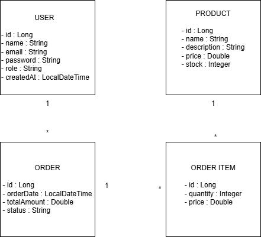

# Virtual Pet

_Tienda virtual especializada en la comercialización de productos para mascotas._

## Introducción / Contexto

_En la actualidad, el crecimiento en la tenencia de mascotas ha generado una mayor demanda de productos esenciales como alimentos, accesorios y medicamentos. No obstante, muchos establecimientos tradicionales no cuentan con plataformas digitales eficientes que permitan gestionar inventarios, visualizar productos y realizar compras en línea de manera estructurada y segura. Esta situación evidencia la necesidad de desarrollar una solución tecnológica que centralice la comercialización de productos para mascotas en un entorno digital accesible y confiable._

_La implementación de una tienda virtual como Virtual Pet resulta relevante desde el punto de vista social y empresarial, ya que facilita el acceso a productos esenciales para el bienestar animal, optimiza los procesos de venta y amplía el alcance comercial de los negocios del sector. Desde el ámbito académico, el proyecto permite aplicar conocimientos de arquitectura de software, desarrollo backend y gestión de dependencias, integrando tecnologías modernas del ecosistema Java._

_Virtual Pet se desarrolla dentro del dominio del comercio electrónico (e-commerce) y los sistemas de información, utilizando Maven como herramienta de gestión y construcción del proyecto, y Spring Boot como framework principal para la creación de una aplicación backend robusta, escalable y estructurada bajo buenas prácticas de desarrollo. De esta manera, el proyecto simula un entorno real de tienda online especializada en productos para mascotas._

## Objetivos

**Objetivo general**

Desarrollar una tienda virtual para mascotas utilizando Spring Boot y Maven que permita gestionar y comercializar productos de manera eficiente, segura y estructurada.

**Objetivos específicos**

OE1 – Diseñar e implementar la arquitectura backend del sistema utilizando Spring Boot bajo el patrón de capas (controlador, servicio y repositorio).

OE2 – Configurar y gestionar las dependencias del proyecto mediante Maven para garantizar una estructura organizada y mantenible.

OE3 – Implementar funcionalidades CRUD para la administración de productos (alimentos, accesorios y medicamentos).

OE4 – Integrar una base de datos para el almacenamiento y consulta persistente de la información de productos.

OE5 – Validar y documentar los endpoints de la aplicación para asegurar su correcto funcionamiento y facilitar futuras integraciones.

## Alcance del proyecto (Scope)

**¿Qué se va a desarrollar?**

*Desarrollo del backend de la tienda virtual utilizando Spring Boot.

*Gestión del proyecto y sus dependencias mediante Maven.

*Implementación de funcionalidades básicas para administrar productos (crear, listar, actualizar y eliminar alimentos, accesorios y medicamentos).

*Conexión a una base de datos para almacenar la información de los productos.

*Desarrollo de un frontend en React (en el marco de otra asignatura) que permitirá a los usuarios visualizar los productos y realizar compras.

*Integración de una pasarela de pagos en modo de prueba (sandbox) para simular el proceso de compra dentro de la tienda virtual.

*Comunicación entre el frontend y el backend mediante servicios web (API REST).


**¿Qué NO se va a desarrollar en esta versión (fuera de alcance)?**

*Aplicación móvil para dispositivos Android o iOS.

*Implementación de múltiples servicios independientes (microservicios).

*Integración con empresas reales de envíos o seguimiento de paquetes.

*Despliegue en servidores empresariales o infraestructura avanzada en la nube.

*Sistema de seguridad avanzado con configuraciones empresariales complejas.

## Tecnologías y Herramientas (Tech Stack)

*Backend:* Spring Boot (versión 3.x), Java 17, Spring Data JPA, integración con base de datos PostgreSQL y H2.

*Frontend:* React (desarrollado en el marco de otra asignatura para consumir la API REST del backend).

*Base de datos:* H2 para pruebas en entorno de desarrollo y PostgreSQL para almacenamiento persistente.

**OTRAS HERRAMIENTAS**

**Gestión de dependencias y construcción:** Maven.

**Control de versiones:** Git y GitHub.

**Pruebas de API:** Postman.


## Integrantes del Equipo

| Nombre | Rol principal | Usuario GitHub |
|--------|---------------|----------------|
| Yuly Marcela Sepúlveda | Líder del proyecto / Backend | @sepumarcela |
| Mariana Rivera Perez | Frontend (React) | @MarianaRPerez8 |
| Felipe Quintero Pulgarin | Backend / Base de datos | @fquinterop |
| Kevin Martinez | Integración y pruebas | @kevinM0022 |

## Diagrama de clases del Dominio (v1)



*Diagrama inicial del modelo de dominio – versión 1. Se actualizará en futuras entregas.*


## Instrucciones de Instalación y Ejecución (para desarrolladores)

1. Clonar el repositorio

```bash
git clone https://github.com/sepumarcela/virtual-pet-grupo-4.git
```

2. Entrar al directorio

```bash
cd virtual-pet-grupo-4
```

3. Configurar base de datos en `src/main/resources/application-dev.properties`

Ejemplo con H2 (para pruebas rápidas):

```properties
spring.datasource.url=jdbc:h2:mem:testdb
spring.datasource.driverClassName=org.h2.Driver
spring.datasource.username=sa
spring.datasource.password=
spring.jpa.database-platform=org.hibernate.dialect.H2Dialect
spring.h2.console.enabled=true
spring.jpa.hibernate.ddl-auto=update
```

Ejemplo con PostgreSQL:

```properties
spring.datasource.url=jdbc:postgresql://localhost:5432/[nombre_bd]
spring.datasource.username=[usuario]
spring.datasource.password=[contraseña]
spring.jpa.hibernate.ddl-auto=update
```

4. Ejecutar la aplicación

```bash
./mvnw spring-boot:run
```

O desde IDE:

Run → VirtualPetApplication